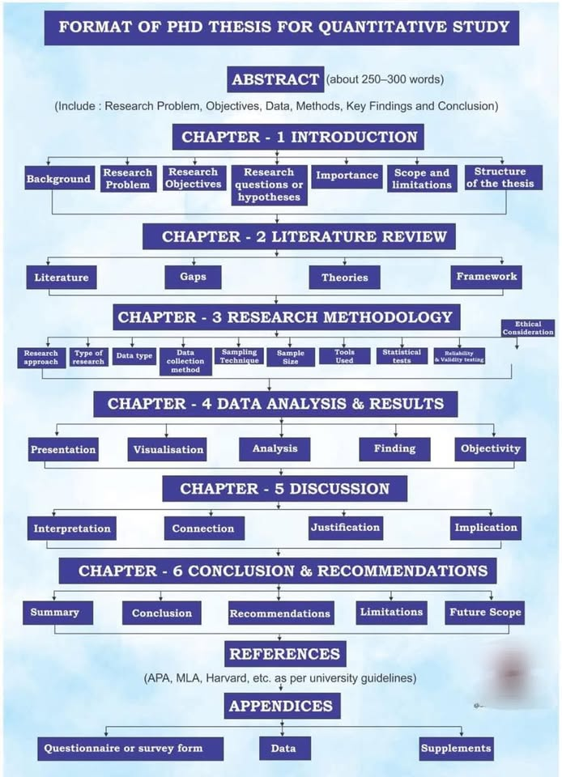
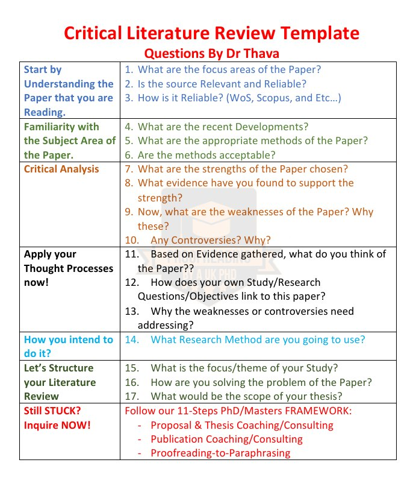
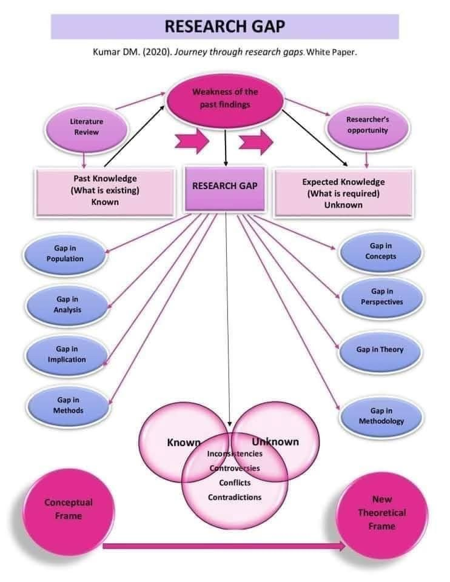
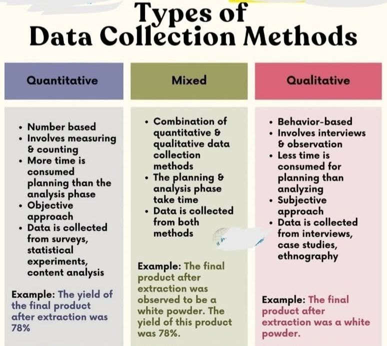
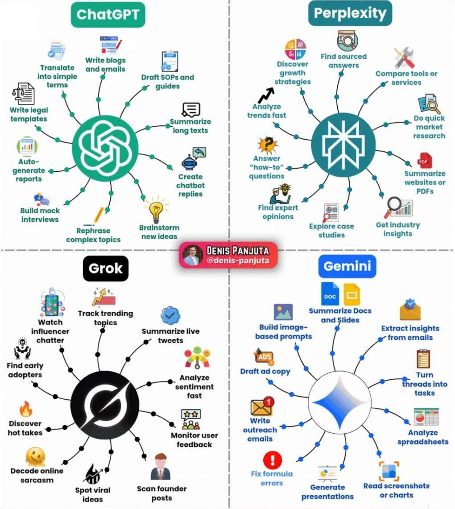

<h1>Nghiên cứu định lượng trong kinh doanh </h1>

<h2>Cấu trúc luận văn định lượng</h2>

<h2>Mẫu viết Literature Revise</h2>

<h2>Khoản trống nghiên cứu</h2>

<h2>Phương thức thu thập dữ liệu</h2>

<h1> $${\color{red}Statistical \space \space Method}$$ </h1>
<h2 style="color: red"><a href="KiemDinh/Hypothesis Testing.pdf">Tổng quang kiểm định</a></h2>
<h2><a href="KiemDinh/Hypothesis_Testing_Cases.pdf">Case kiểm định giải tuyết</a></h2>
<embed src="KiemDinh/Hypothesis_Testing_Cases.pdf" type="application/pdf" width="800" />

<h2>Công cụ AI</h2>

